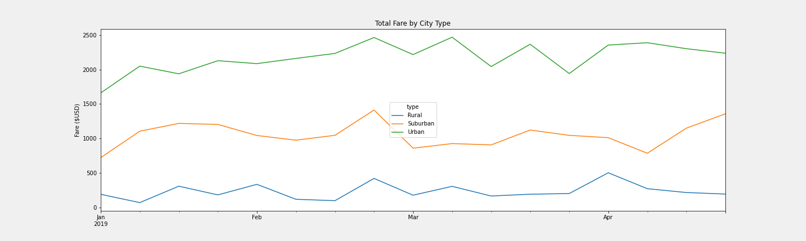

# PyBer_Analysis

## Overview

The purpose of this assignment is to look at data from the company PyBer, a rideshare company valued at $2.3 billion, and create an impactful analysis using the data and visualization tools. Our goal is to look at the overall fare averages based on city location type (Urban, Suburban, and Rural) and driver availability and make recommendations to help better the business model of PyBer.

## Resources

Files: city_data.csv, ride_data.csv
Software/programs: Python 3.7.6, Jupyter Notebook, Pandas, Matplotlib

## Results

### Differences In the Data

After completing our analysis we can see that there are some stark differences in the ride-sharing data. We notice that ride accessibility in suburban and especially in rural areas is not only more limited but also more expensive. Below is a data frame summary of key statistical information:

We can note several important pieces of information in this data frame. In our first two columns, we can see right away that urban cities boast the highest number of total rides and total drivers. This information logically tracks as we can infer that the demand for rides, and therefore the number of drivers available, in urban cities would need to be high to move the population of those cities. This is presented in contrast to the suburban and rural cities whose total counts continue to see a decrease as population density decreases.

Something worth noting in our data frame is that in suburban cities there is only a 2.5x decrease in total rides, while the total number of drivers in the suburbs decreases by nearly 5x. While this makes sense for the ride demand, the average fare prices become a bit muddled. We see that per ride average fares are set at $24.53 in urban cities. This values an urban ride at a lower price than in the suburbs ($30.97) and rural areas ($34.62). This makes sense because urban cities are usually more condensed causing ride distances to be less, therefore making the fare for those rides less as well. When a drive goes more rural, distance and time spent on the drive increases, which will inevitably increase the fare per ride.

However, one is quick to raise an eyebrow at the increase in fare per driver. There is a very significant disparity in fare per driver when comparing the average fare by city type. We see that in urban cities the average fare per driver is $16.57, while in suburban and rural cities the average fare is $39.50 and $55.49 respectively. This is an almost 3x increase in average fare from urban to rural cities. There are several reasons that this disparity in the average fares per driver could happen. There could be an oversaturation of drivers in urban areas making competition between drivers and their prices very high causing the prices to remain low. Of course, the explanation for the very increased fare can be explained in the inverse as well, by the low availability of drivers in rural areas. Meanwhile, in suburban and rural areas, the demand may only decrease a little in comparison to urban areas, but the amount of drivers is lower allowing the price to go up and still have their service in demand. When the supply is low and the demand is high (or even a medium demand) the price can increase quite dramatically. It is worth noting that despite the price increase, the total fares accumulated in rural areas are barely 1/5 of the suburban total and not even 1/8 of the urban total fares. This shows that even with the price inflation, rural areas are not bringing in any sort of impactful financial gain. There could be an opportunity for PyBer to review their price structure in each city type as well as their driver count depending on the type of services they would like to offer.

### A Visual Look at the Data

As seen in the graph above we can see some additional detailed information about our PyBer data. Here we can see a detailed outline of total fares per month by city type from January through April 2019. This gives us a clearer idea of when peak weeks in each month may happen and when the highest fares appear. This can help to inform us of other factors that can impact fares, such as lack or excess of driver availability due to a holiday or "off-peak" time of year. In our graph, we can already affirm this theory as we can see that in urban cities there was a peak in the second week of March, around St. Patrick's Day. Since this holiday, especially in urban cities, is marked by drinking alcohol in pubs, there would naturally be an increase in demand for PyBer's rides which would increase the fare. Also, towards the end of April in the suburbs, we see a gradual but significant increase in fare which may be able to be attributed by families and students using PyBer to get them from their suburban city to the airport for Spring Break or it could be that the suburbs are generally trending up in the use of PyBer's services.

## Conclusion

Based on the analysis I can provide the following recommendations to V. Isualize:

1. **Driver Accessibility by City Type:** We must address the disparity in fare per driver between urban and rural cities. The extremely low price in urban areas is due to overpopulation in drivers. As a way to even out average fares in each type of city without compromising profits, we could relocate some drivers from urban cities to the suburbs and rural areas. Of course, we should not relocate too many as to make ride accessibility in urban cities decrease and create an over-accessibility problem in rural areas, but just enough drivers to see a small, but perhaps impactful, change on the average fare per driver. This would make the average fares in each city type per driver average out to a more reasonable distribution, perhaps more similar to the numbers seen in the average fare per ride.

2. **Holiday Planning:** Looking ahead at the year, we should plan to driver availability (and in turn, adjust prices) throughout each month but especially when a holiday like Valentine's Day, St. Patrick's Day, or the Fourth of July rolls around. We can see that during holidays fares increase and we know that fares are most likely to increase when there is a lack of drivers. Incentivize drivers with rewards or bonus earnings by driving on a holiday/holiday week to remedy this.

3. **Stuck In the Suburbs:** From mid-April as it came to a close we could see the suburbs making a gradual and significant increase in fares. There could be an opportunity to increase drivers in the suburbs, either seasonally or permanently, to help keep fares low for the riders and increase availability and revenue for the company.